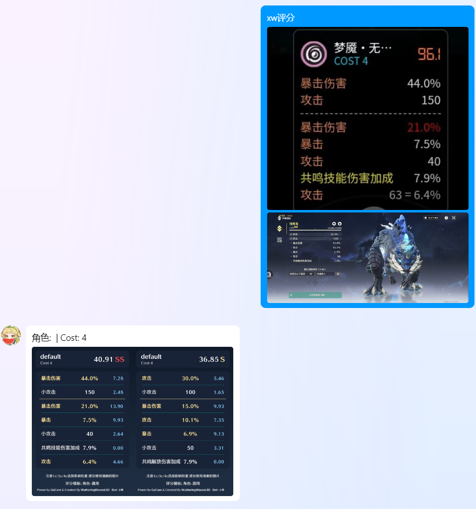
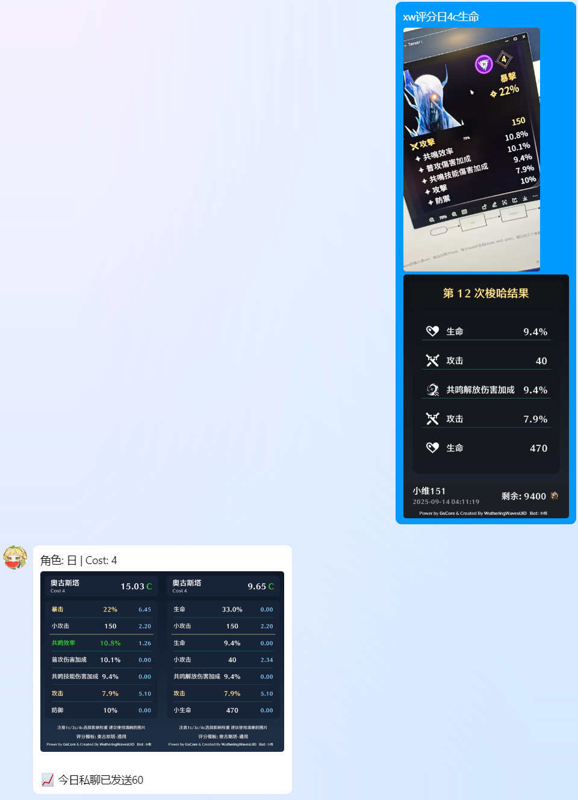
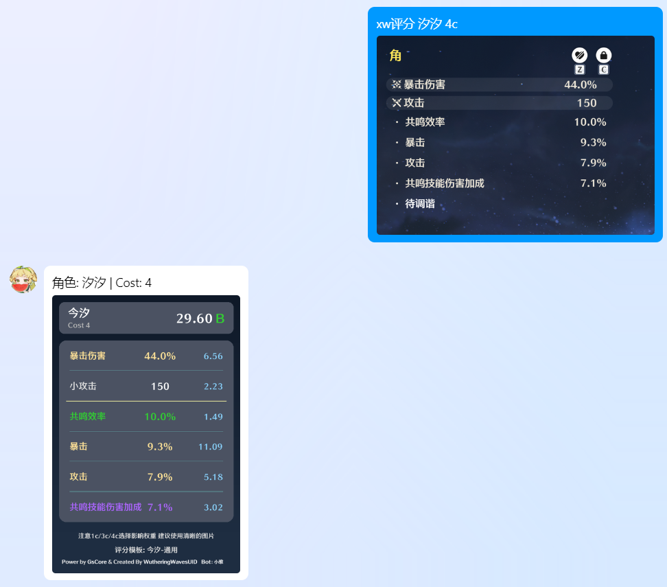
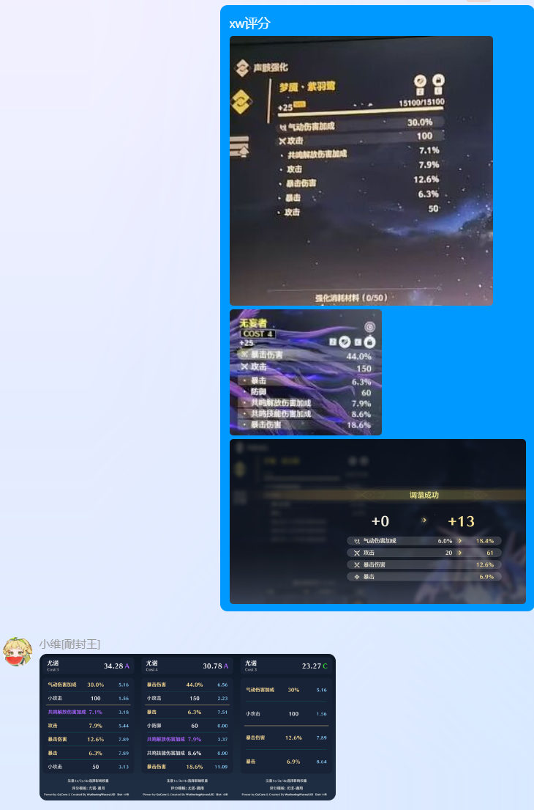
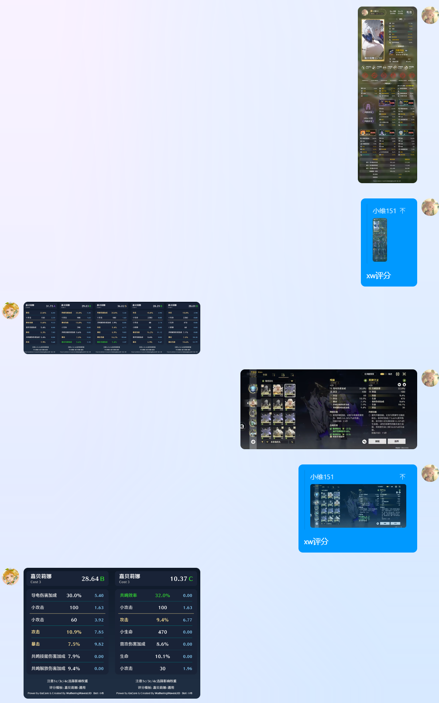
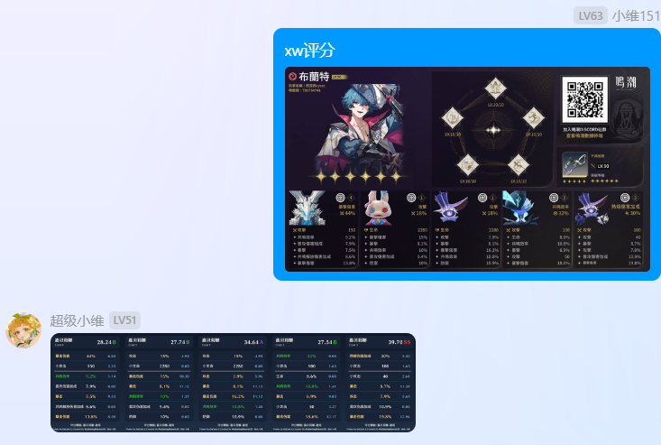
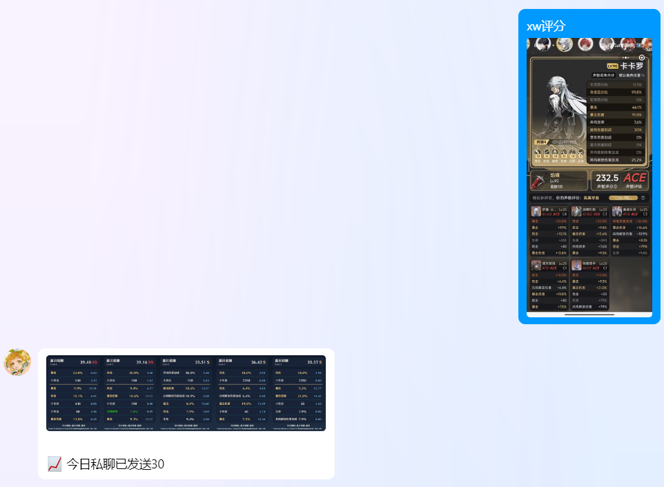

### 小维OCR识别声骸并评分

需要在控制台填写`xwtoken`，群里直接戳我就行

api二次开发要求：上传图片大小不能超过1mb每张，速率不得超过10fps。主要是为了支持引用回复，或者直接修改

在线使用：[https://scoreecho.loping151.site/](https://scoreecho.loping151.site/)，注意web具有较高的数量限制。如果你一定要直接用web api也可以来用我的代理池（

### 合法指令说明

[前缀：如ww] 评分 [角色名] [4c/3c/1c（可选，不覆盖）] [第一主词条（可选，覆盖）]，如 `ww评分想嗦4c爆伤`
[前缀：如ww] [角色名] [4c/3c/1c（必须，但不覆盖）] [第一主词条（可选，覆盖）]，如 `ww卡提4c` 或 `ww卡提评分4c爆伤`
[前缀：如ww] [角色名] 评分，如 `ww卡提评分`

- **触发词**：评分/查分，或直接 xx几c
- **角色名**：可用别名（使用小维的别名表），未匹配上则使用一个默认角色，一般是当前up（需要我想起来改）
- **cost数**：只需要4，3，1即可，4c/c4/4C/C4都是合法的表达，如果图中有主词条将尝试自动识别
- **主词条**：当OCR结果中没有主词条的时候才有效，默认暴击。必须是合法的主词条。指定主词条时必须指定cost数。

支持繁体。支持多图，支持部分同一图中有多个声骸的情况，见下方例子。如希望开发其他框架插件，请添加我为collabotor。

### 引用支持

需要修改适配器，但十分容易。以nb onebotv11为例：

```python
    # onebot
    elif bot.adapter.get_name() == 'OneBot V11':
        from nonebot.adapters.onebot.v11.event import (
            GroupMessageEvent,
            PrivateMessageEvent,
        )

        if isinstance(ev, GroupMessageEvent) or isinstance(
            ev, PrivateMessageEvent
        ):
            messages = ev.original_message
            msg_id = str(ev.message_id)
            if ev.sender.role == 'owner':
                pm = 2
            elif ev.sender.role == 'admin':
                pm = 3

            sender = ev.sender.dict(exclude_none=True)
            sender['avatar'] = f'http://q1.qlogo.cn/g?b=qq&nk={user_id}&s=640'

            if isinstance(ev, GroupMessageEvent):
                user_type = 'group'
                group_id = str(ev.group_id)
            else:
                user_type = 'direct'
                
+           if hasattr(ev, 'reply') and ev.reply:
+               for seg in ev.reply.message:
+                   if seg.type == 'image' and seg.data:
+                       message.append(Message('image', seg.data['url']))
        else:
            logger.debug('[gsuid] 不支持该 onebotv11 事件...')
            return
```

### 其他实现逻辑说明

当仅没有第二主词条时（如小程序）将尝试补齐第二主词条。当没有主词条时将尝试补齐两条主词条，但建议手动。不要求副词条达到5条，但词条不足时可能识别不全，因为主词条数值只允许为25级的值，如爆伤：44%。如希望评分为开完的声骸，应仅截图副词条部分。

评分更新模板依赖小维自身wwuid的更新。反正一般会及时。

### 本插件用例
**覆盖小程序/discord/游戏内截图/拍屏大师**

展示多图合并


小程序1，已尝试多个小程序均可识别


繁体discord+斜拍，以及配合TodayEcho插件使用例


未调谐的声骸


分辨率仅100p的图片，使用门锁拍摄


支持wwuid面板直接重新评分，支持游戏内声骸对比页面的双评分


我去，这都行



本插件用时30min，何尝不是一种竞速。
