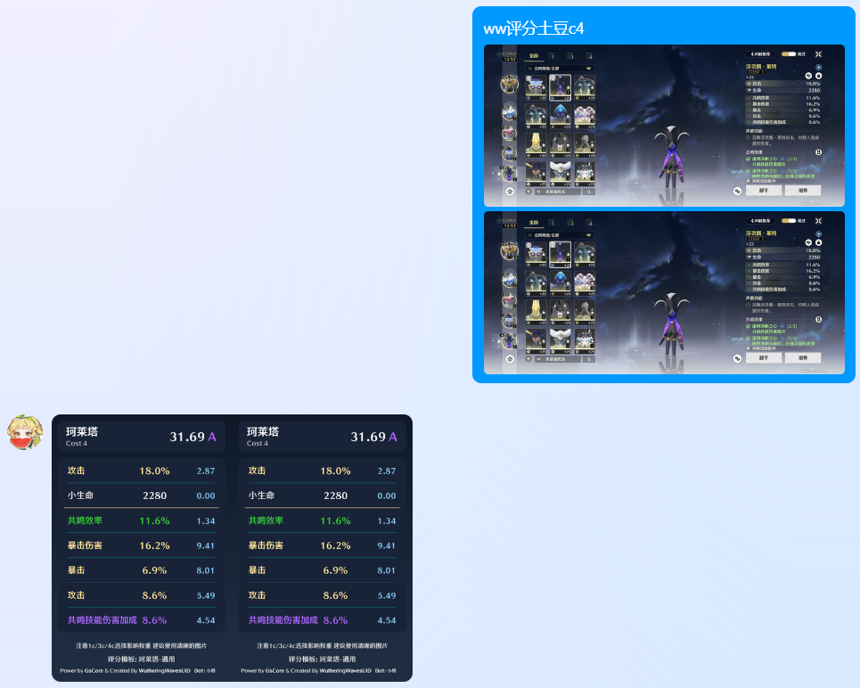

OCR识别声骸并评分

需要在控制台填写token

如果报错没有PIL: uv add pillow

api二次开发要求：上传图片大小不能超过1mb每张，速率不得超过10fps

合法指令说明：

[前缀：ww] 评分 [角色名] [4c/3c/1c] [主词条]

- **角色名**：可用别名（使用小维的别名表），未匹配上则使用默认双爆
- **cost数**：只需要4，3，1即可，4c/c4/4C/C4都是合法的表达
- **主词条**：当OCR结果中没有主词条的时候才有效，默认暴击。必须是合法的主词条

支持繁体。支持多图，但不支持同一张图中有多组词条。如希望开发其他框架插件，请添加我为collabotor。

其他实现逻辑说明：当仅没有第二主词条时（如小程序）将尝试补齐第二主词条。当没有主词条时将尝试补齐主词条。不要求副词条达到5条，但要求声骸强化到25级，因为主词条数值只允许为25级的值，如爆伤：44%。如希望部分评分，应仅截图副词条部分。

本插件用例：

